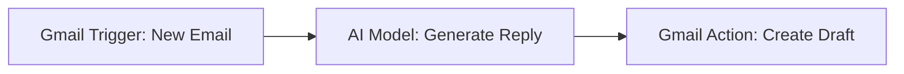

# Automated AI Email Draft Generator

This repository contains an n8n workflow that acts as an intelligent inbox assistant. It automatically reads incoming emails, uses an AI model to comprehend the context, and generates a fully written reply. Instead of auto-sending, it safely stages the reply as a draft in Gmail, keeping a human in the loop for final approval.

### Architecture Diagram

### How It Works

1. **Gmail Trigger:** Listens continuously for new incoming emails matching specific criteria (e.g., specific labels, unread status, or specific senders).
2. **Message a Model:** The email subject and body are passed to a Large Language Model (LLM) with a custom system prompt. The AI acts as a customer service representative, analyzing the inquiry and generating a polite, accurate, and context-aware response.
3. **Create a Draft:** The workflow connects back to the Gmail API to create a new draft message formatted as a direct reply to the original sender, injecting the AI-generated text into the email body.

### Business Impact

* **Human-in-the-Loop Safety:** Drastically speeds up email response times without the risk of an AI hallucinating and sending incorrect information directly to a client.
* **Night-Shift Efficiency:** Perfect for operations requiring 24/7 responsiveness, such as hospitality or e-commerce. The AI prepares responses for late-night inquiries instantly, allowing the morning team or night manager to review and send them in seconds.
* **Scalability:** Handles high volumes of repetitive inquiries (e.g., booking questions, availability checks, or order statuses) without requiring additional manual data entry.

### Setup Instructions

1. Import `workflow.json` into your local or cloud n8n instance.
2. Configure **Gmail OAuth2 Credentials** in n8n (requires enabling the Gmail API in Google Cloud Console with draft creation permissions).
3. Connect your preferred AI provider (e.g., OpenAI, Google Gemini, or a local model via AnythingLLM/Ollama) to the `Message a model` node.
4. Update the AI system prompt to match your specific brand voice and business logic.
