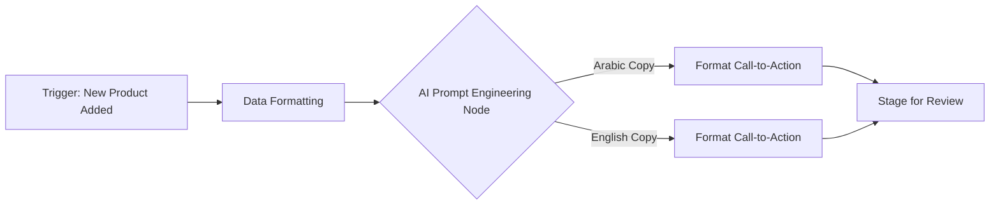

# Automated E-commerce Social Media Pipeline

This repository contains an n8n workflow designed to automate the creation of promotional social media content for an online women's clothing store. It eliminates manual copywriting by instantly generating localized, conversion-optimized marketing text for new apparel collections.

### Architecture Diagram

### Business Impact
* **Time Saved:** Automates the drafting of promotional headlines and targeted calls-to-action for every new product release.
* **Consistency:** Ensures brand voice is maintained across all advertising media.
* **Multilingual Reach:** Instantly creates parallel campaigns in both Arabic and English to maximize engagement across different customer segments.

### Setup Instructions
1. Import `workflow.json` into your n8n instance.
2. Connect your preferred LLM credential (e.g., OpenAI or a local Ollama instance).
3. Update the prompt engineering nodes to reflect your specific brand guidelines and apparel descriptions.
